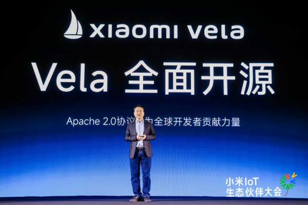
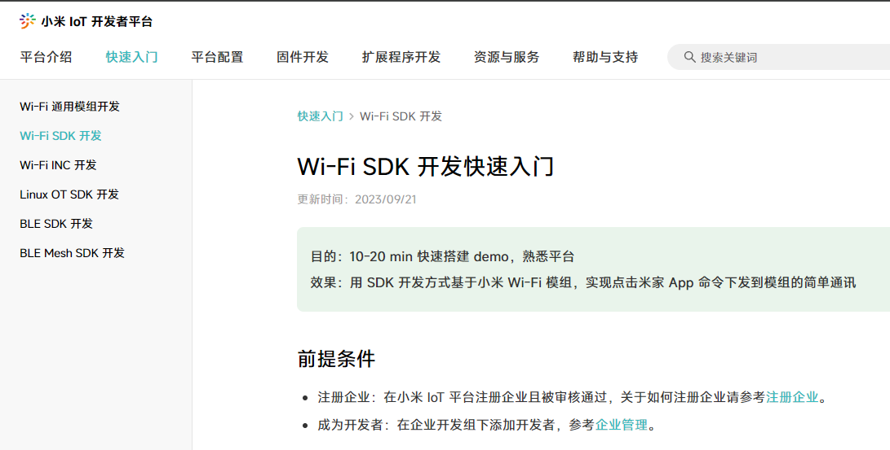
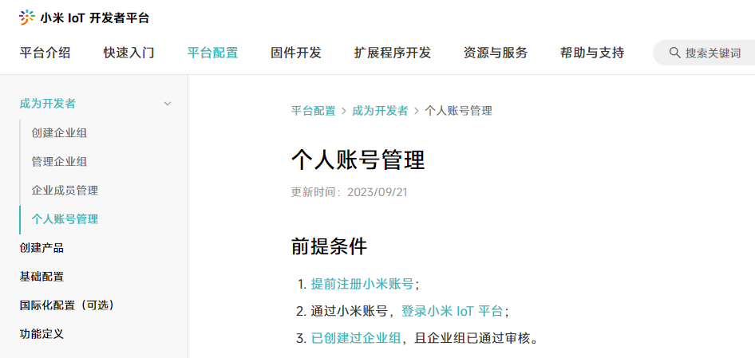
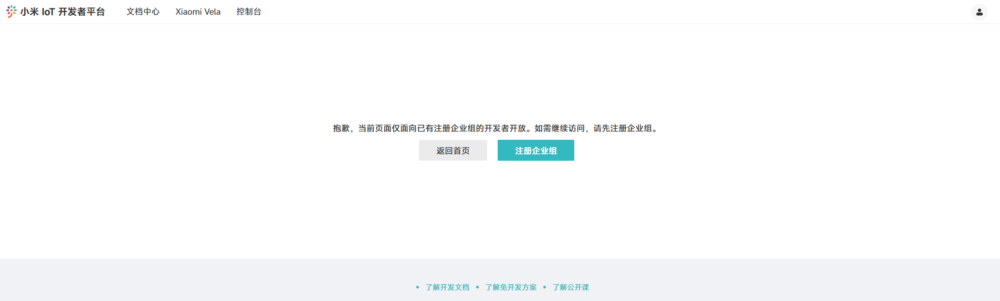
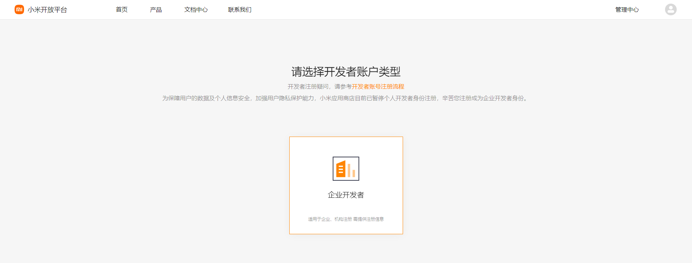
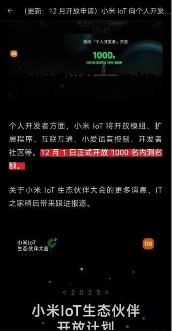

# 小米新国货，冉冉中国芯

你说的对，但是Vela是一款基于Nuttx进行二次开发的RTOS操作系统。支持大量平台运行，拥有不为外人所知的神必社区😁

我们的创新之处在于利用Apache 2.0重新定义了全面开源，不需要让所有用户自由地获取，使用源代码，也能够称之为开源😆

我们重新定义了全面拥抱开发者的概念，只有企业开发者才值得我们拥抱😩

我们的基础能力更是遥遥领先，远远超过了市面上所有竞品🥳

我们还创新性地在官宣开源后，再推出了个人开发者1000人限量内测的神必操作，把小米社区KPI任务的优良传统贯彻到底🤭

附录:

Permissive License - 宽松许可证
Derivative Works - 派生作品
Worldwide - 世界范围
Royalty-Free - 免费授权
Patent Grant - 专利授权
Non-exclusive - 非独家的
Distribution - 分发
Source Code - 源代码
Binary Form - 二进制形式
Notice - 注意事项
License - 许可证
Irrevocable - 不可撤销的

[Apache_2.0是什么](https://www.apache.org/licenses/LICENSE-2.0)
[米粉必看1](https://www.google.com.hk/search?q=%E5%B0%8F%E7%B1%B3+P2P)
[米粉必看2](https://www.google.com.hk/search?q=%E5%B0%8F%E7%B1%B3+%E7%A7%AF%E6%9C%A8%E7%9B%92%E5%AD%90)

为什么Vela的IDE只支持在Ubuntu使用呢，不会是搞不定交叉编译链，只能在GUN环境下用吧？🤗